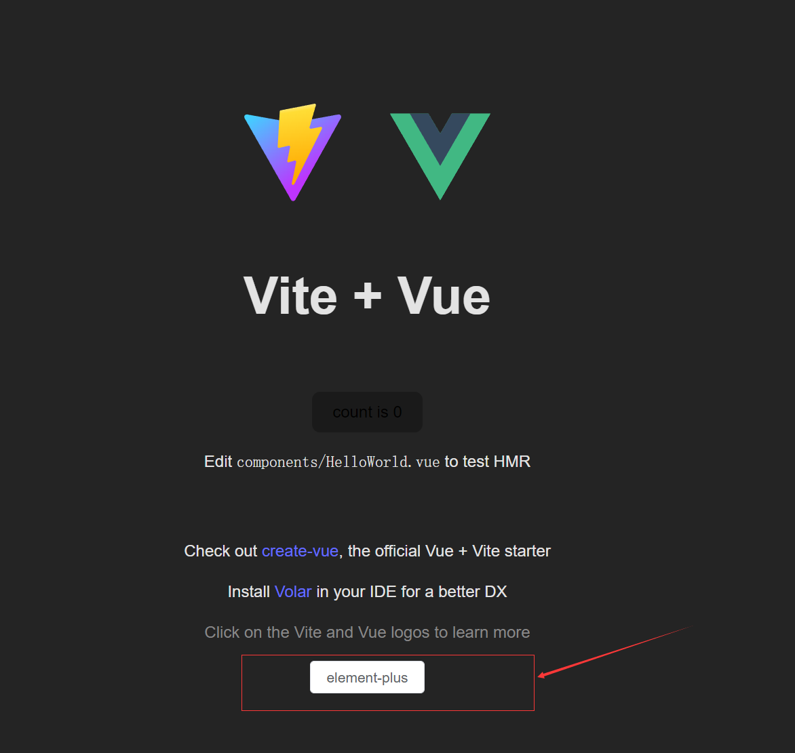

# 前置安装

在根目录中

npm init vite@latest

?project name :frontend

然后在front目录下生成一些列工程文件

1. 配置 vite.config.js
2. 新增 jsconfig.json

# 启动

```bash
npm install -g nvmw # node 包管理工具
nvmw install v16 # 下载
nvmw use v16 # 使用该版本的 nvmw
npm install -g yarn
yarn
yarn config set ignore-engines true

yarn add unplugin-vue-components -D # https://element-plus.gitee.io/zh-CN/
yarn add element-plus vuex@next vue-router@next axios
yarn add prettier -D # 安装 prettier 插件
yarn add normalize.css # 重置样式
yarn dev
```

在 src/App.vue 中的 template 中添加如下代码，则有如下效果

`<el-button>element-plus ``</el-button>`




# Vue 3 + Vite

This template should help get you started developing with Vue 3 in Vite. The template uses Vue 3 `<script setup>` SFCs, check out the [script setup docs](https://v3.vuejs.org/api/sfc-script-setup.html#sfc-script-setup) to learn more.

## Recommended IDE Setup

- [VS Code](https://code.visualstudio.com/) + [Volar](https://marketplace.visualstudio.com/items?itemName=Vue.volar)
